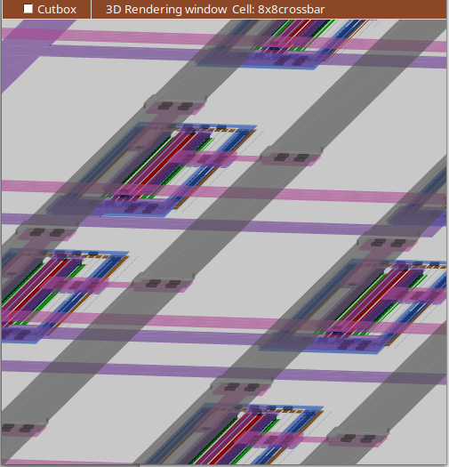
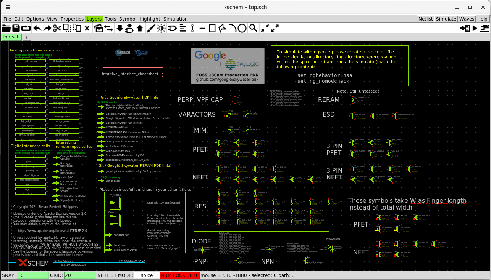
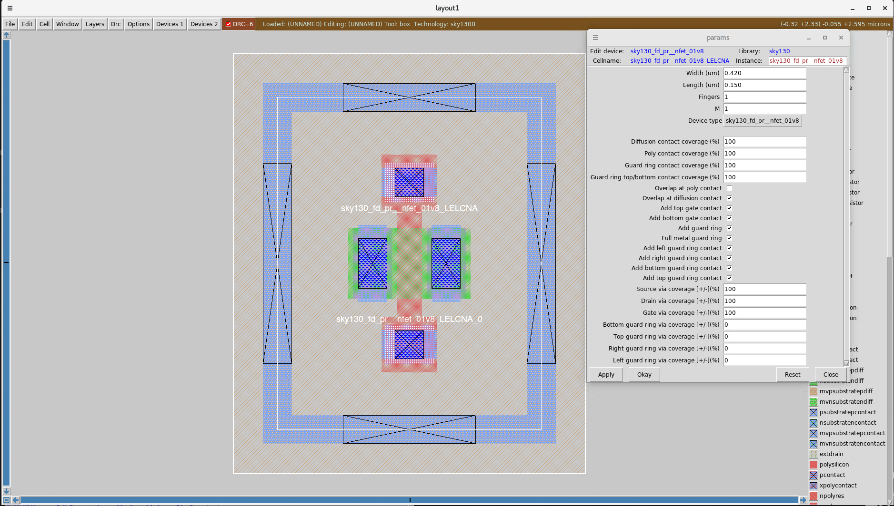

# Iowa State University <br/> SDDEC24-13: RERAM COMPUTE CROSSBAR FABRICATION

<!-- <p align="center">
  
</p> -->


This is the project repository of Iowa State ECE Senior Design Team SDDEC24-13. The goal of this design team was to develop a research vehicle for silicon, exploring the computational capabilities of a Resistive Random Access Memory (ReRAM or RRAM) crossbar. This circuit was developed in the Skywater SKY130nm process and follows the Efabless design flow which uses the open source tools featured in the caravel harness workflow. 

Currently, the individual components for this project function correctly. Most components have associated layouts that have passed DRC and LVS (Please reference the [Future Work](#FutureWork) for more information). Unfortunatly, these components have not been tested completely as a system due to time constraints. 

[Link to senior design website.](https://sddec24-13.sd.ece.iastate.edu/)

- Still need to update README
- Missing Verilog stuff
- Missing .tcl stuff
- Missing C code for periphs
- Missing Documents

## Table of Contents
 - [General Design](#GeneralDesign) 
 - [Setup](#Setup)
    - [General Setup Guide](#GeneralSetup)
    - [Tools](#Tools)
    - [Caravel Harness](#Carvel)
    - [PDK](#PDK)
 - [Relavent Resources](#RelaventResources) 
 - [FAQ Issues](#FAQIssues)
 - [Future Work](#FutureWork)

## General Design <a id="GeneralDesign"></a>


## Setup <a id="Setup"></a>

### General Setup Guide <a id="GeneralSetup"></a>

1) Install the Skywater 130nm PDK
2) Install all relavent software and software dependencies or activate toolchain
3) Pull this repository and replace identical folders in the Analog Caravel Harness repository
4) Install the Analog Caravel Harness repository
5) Set the following enviornment variables as such
```sh
export OPENLANE_ROOT=$(pwd)/path/to/caravel_user_project_analog/dependencies/openlane_src
export PDK=sky130B
export PDK_ROOT=$(pwd)/path/to/caravel_user_project_analog/dependencies/pdks
export PATH="/home/user/.local/bin:$PATH"
```
6) To ensure everything has been installed correctly, you could check the following:
   - Xschem:
      - Launch Xschem in the \xschem directory (Or a directory with .xschemrc) with the following command:

      ```sh
      xschem
      ```
      - Xschem should pull up a schematic "top.sch" that should look like this: \
      
   - Magic VLSI
      - Launch Magic VLSI with the sky130B PDK in the \mag folder (or any folder with the file "sky130B.magicrc")  with the following command:
      ```sh
      magic -rcfile sky130B.magicrc
      ```
      - Magic VLSI should pull up with the sky130B technology
      - The Devices 1 and Devices 2 options should be available as well
      - You can test gencell by placing a device, an example of a min sized NMOS looks like this:
      

### Tools <a id="Tools"></a>
This project is confirmed to work on Red Hat Enterprise Linux 8.10 (Ootpa). \
The tools used in this design enviornment is as follows (The project is confirmed to function with the provided tool versions):

- Xschem v3.4.4
- Ngspice v42
- Magic VLSI v8.3 revision 460
- Netgen v1.5.270
- Openlane v1.1.1
- GTKwave v3.3.118
- Klayout v0.28.16

If you have access to Iowa State University ChipForge's toolchain, version 1.0.4 was used during the development of this project and is confirmed to work. 
At the time of writing this, you can install the toolchain onto the Linux Coover machines with the following command:
```sh
curl -L https://git.ece.iastate.edu/api/v4/projects/6423/packages/generic/toolchain/1.0.4/toolchain.tar.gz | tar xz
```
To activate the toolchain:
```sh
~/toolchain/activate
```
Otherwise, follow the "TODO: Josh Thater's Doc" for further instructions regarding software and software dependency installation.

### Caravel Harness <a id="Carvel"></a>
This project uses the [analog caravel harness repository template](https://github.com/efabless/caravel_user_project_analog) as the main framework. For digital circuit synthesis and hardening, we used the OpenLane workflow from the [digital caravel harness repository template](https://github.com/efabless/caravel).

### PDK <a id="PDK"></a>
The PDK used in this project is the [Skywater SKY130nm](https://github.com/google/skywater-pdk). For ReRAM support, SKY130B will be used. \
To install the PDK on your own system, directions can be found here (TODO: Josh Thater's doc)\
Installing the PDK on the Coover computers can be done through Volare by following these instructions from this document (TODO: Konnor's doc)

1) Update the Makefile located in the */caravel_user_project_analog* directory with the following: \
**IMPORTANT:** These may change with time and you’ll have to monitor or ask on Slack if something has changed.
```sh
MPW_TAG ?= 2024.09.13-1
export OPEN_PDKS_COMMIT?=0fe599b2afb6708d281543108caf8310912f54af
```
 

2) Configure enviornment variables as such:
```sh
export CARAVEL_ROOT=(pwd)/path/to/caravel_user_project_analog/caravel
export PDK=sky130B
export PDK_ROOT="/home/user/PDK"
```

3) Install Volare locally with Python via the following command:
```sh
pip3 install --user volare
```

4) Make the PDK resources with the following command in your */caravel_user_project_analog* directory
```sh
make pdk-with-volare
```

## Relavent Resources <a id="RelaventResources"></a>
Here are some resources we used throughout our project or we believe are useful to the deveoplment of relative projects.

- [sddec24-13 Final Design Document](README_files/SDDEC24_13_DESIGN_DOCUMENT_492.pdf)
   - This project was a senior design project in partial fulfillment of the requirements for Iowa State Univeristy's ECpE undergraduate program which required competent documentation of development and results
   - Linked is the final report of this design which covers the design process of this project in-depth
- [sddec24-13 IRP Presentation](README_files/sddec24-13_final_492_presentaion.pdf)
   - This project was a senior design project in partial fulfillment of the requirements for Iowa State Univeristy's ECpE undergraduate program which required an Industry Review Panel presentation
   - Linked is the final presentation of this project
- [Iowa State University ChipForge documentation](https://git-pages.ece.iastate.edu/isu-chip-fab/documentation/#/)
   - This project relied extensively on the tools provided by Iowa State University's ChipForge 
   - Linked is the official wiki for Iowa State University's ChipForge   
- [sddec23-08 Analog Design Flow Tutorial](README_files/Senior_Design_Enviornment_ReRAM_Setup.pdf)
   - This project was a continuation of the work done by Iowa State University ECE senior design team sddec23-08
   - Linked is a comprehensive guide for setting up the analog tool enviornment and a tutorial to Xschem and Magic VLSI
- [ReRAM Precheck Guide](README_files/Precheck_reram_precheck.pdf)
   - Linked is a brief guide on installing the PDK with volare and setting up and running precheck for ReRAM models
- [ReRAM Simulation Issue](README_files/ReRAM_Model_Discrepancies.pdf)
   - Linked is a brief overview of ReRAM model issues found during spice simulation
- [Digital Circuits in Xschem](README_files/A_Brief_Excerpt_on_Mixed_Signal_Circuits_for_Xschem.pdf)
   - Linked is a brief tutorial on implementing Verilog defined circuits in Xschem for behavioural simulation


## FAQ Issues <a id="FAQIssues"></a>


## Future Work <a id="FutureWork"></a>